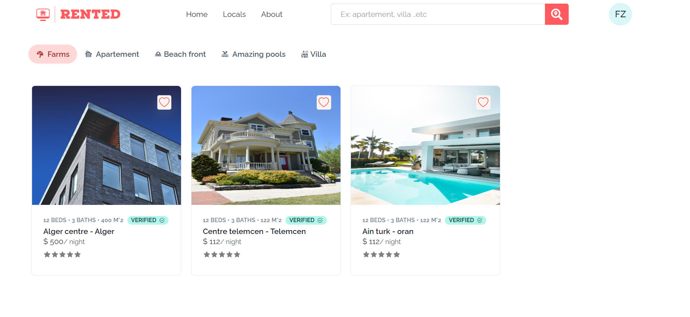
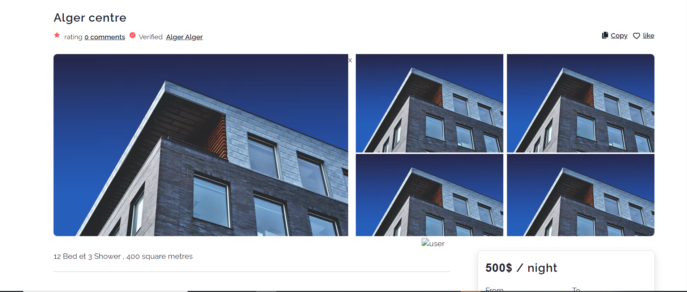
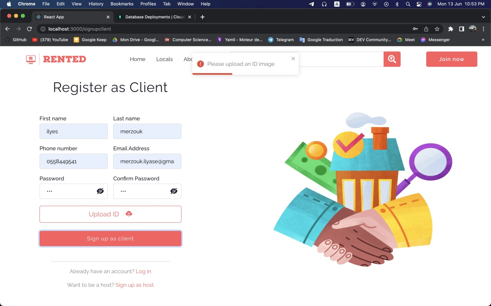
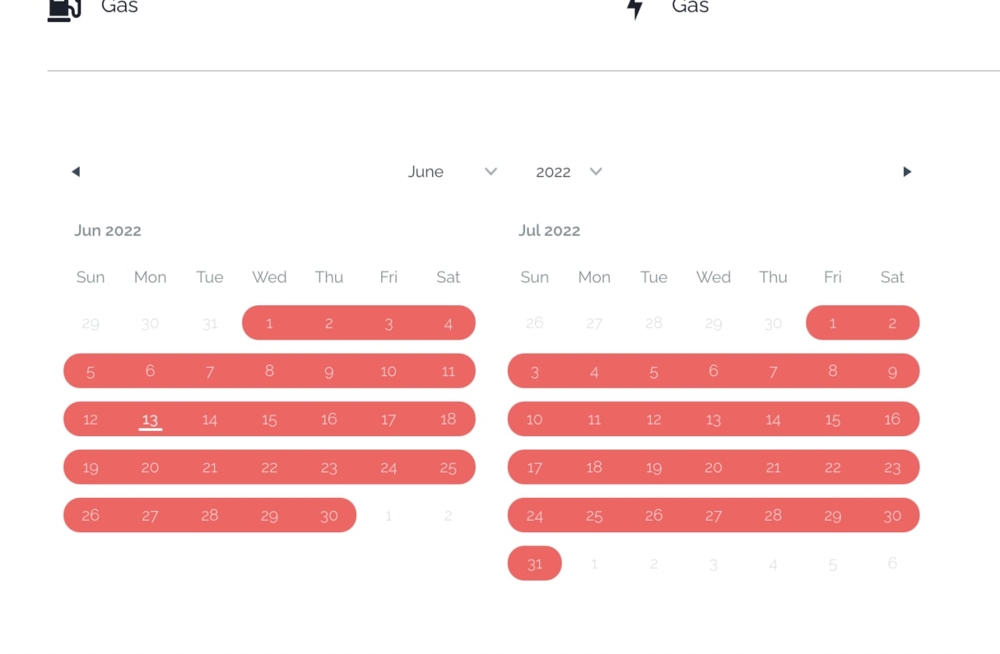
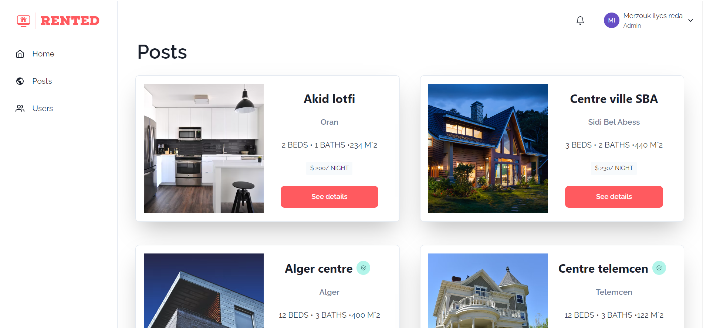
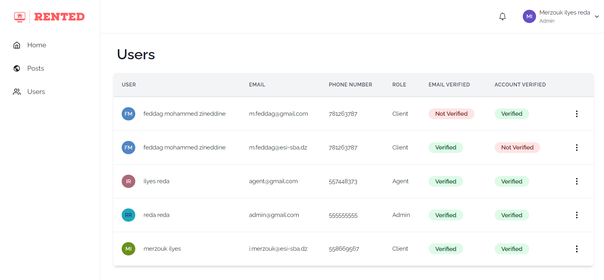
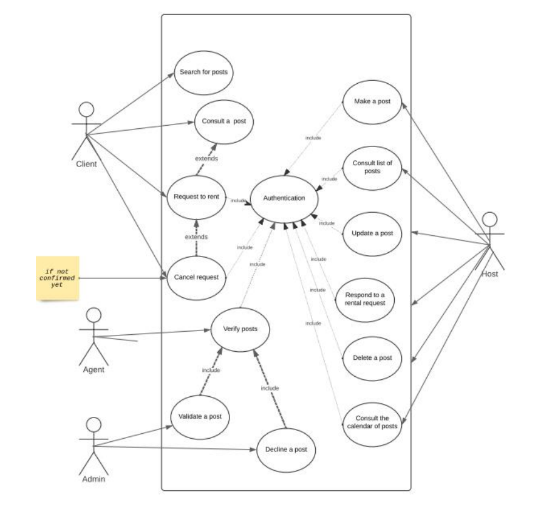
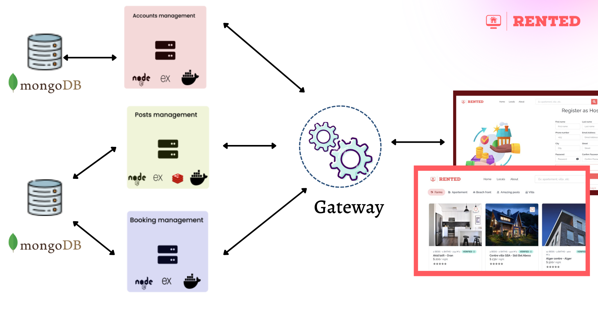
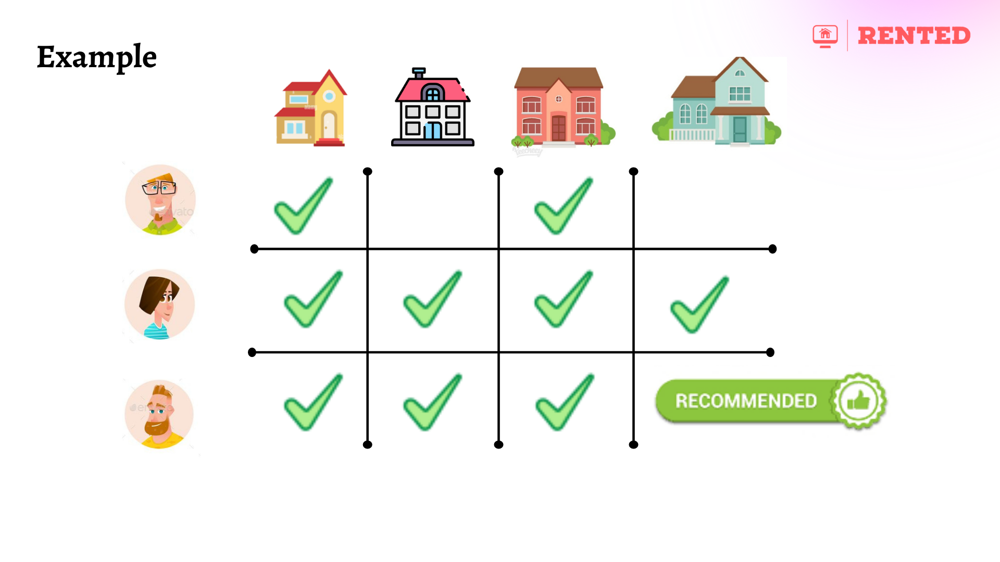

RENTED
===


 
   
    
   
 


## Summary :
#### RENTED is a website app created to be a link between poeple searching for appartemens to rent , and hosts . it provides confidential solutions to make renting easier then ever . created with the mern stack .  

 [View project specifications !](https://www.canva.com/design/DAFDhx_rEnk/vQuHlD6T1Fswz2f0AcIeBw/edit?utm_content=DAFDhx_rEnk&utm_campaign=designshare&utm_medium=link2&utm_source=sharebutton)
 
 

## How use this app as a developer

## Using Docker
1. git clone the repo
2. run docker compose-up

### Old way 
1. git clone 
2. npm install for all the repositories
3. run all project repos 
4. run the reduis server (use wsl for windows)

if you have any question don't hesitate to ask :+1: 

User story
---

```gherkin=
    As a client, I can serve the website.
    As a client, I can reserve an appartement 
    As a client, I can search appartements
    As a client, I can view or cancel my reservations
    As a client, I can upgrade to host

```
```gherkin=
    As a host, I can post new locations
    As a host, I can accept or refuse reservation requests
    As a host, I can review my posts hystory
    As a host, I can report a client 


```
```gherkin=
    As an admin, I can manage accounts , validate or delete accounts
    As an admin, I can view my daily , weekly and monthly statistics.
    As an admin, I can assign post to agents and verify posts.

```

### general use case diagram : 



## architecture schema
we used microservices in this project , Microservices refer to both an architecture and a software development approach that consists of breaking down applications into the simplest elements, independent of each other.  




## Our recomendations 
we used a js library that uses the KNN algorithme for a Collaborative Filtering  Recommendation system 



Used Technology
---


availble roles
---
1. client
2. host
3. agent
4. admin

Rented provides
---
- reservation gesture
- accounts gesture
- posts gesture
- recommendation gesture

---
---
If you liked the repo then kindly support it by giving it a star ⭐ and share in your circles so more people can benefit from the effort.

## Contributions Welcome
[](#)

If you find any bug in the code or have any improvements in mind then feel free to generate a pull request.

## Issues

[](https://github.com/Merzouk-Ilyes/Projet-2CS-Front/issues)

If you face any issue, you can create a new issue in the Issues Tab and I will be glad to help you out.


## Contributors

<a href="https://github.com/Merzouk-Ilyes/Projet-2CS-Front/graphs/contributors">
  
</a>

